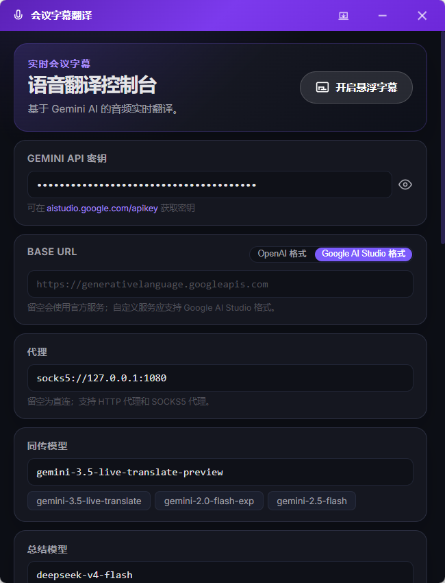

# Gemini Live Translate X

面向 Windows 的实时会议翻译工具，使用系统音频捕获会议内容，并通过 Gemini Live Translate API 提供实时字幕与翻译。

## 功能

- 捕获系统音频，并实时处理会议内容。
- 显示中文、英文原文及翻译字幕。
- 支持可独立调整样式的悬浮字幕窗口。
- 支持字幕历史记录、复制、对齐和 AI 总结。
- 支持翻译音频播放及相关设置。

## 界面预览

### 主界面



### 实时字幕


### 字幕历史


### 功能总览


## 运行环境

- Windows 10 或更高版本。
- Node.js 和 npm。
- 支持 Tauri 2 的 Rust 工具链。
- 具备目标实时翻译模型访问权限的 Gemini API 密钥。

## 开发运行

在项目的 `app` 目录中执行：

```bash
npm install
npm run tauri dev
```

也可以在 Windows 中运行 `app/start-tauri-dev.bat`。

## 验证

在 `app` 目录中执行：

```bash
npm test
npm run build
```

## 项目结构

```text
app/
├── index.html          主控制窗口
├── history.html        历史字幕窗口
├── summary.html        AI 总结窗口
├── src/                TypeScript 界面与字幕逻辑
└── src-tauri/          Rust 音频处理与窗口集成
```

## 许可证

MIT
